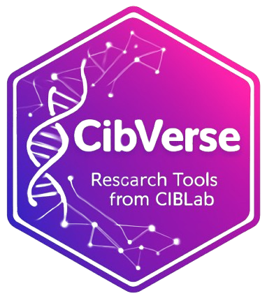

<p align="center">
  
</p>

<p align="center">
  <!-- ⭐ Stars -->
  <a href="https://github.com/CibLab/CibVerse/stargazers">
    
  </a>
  <!-- 🐞 Issues -->
  <a href="https://github.com/CibLab/CibVerse/issues">
    
  </a>
  <!-- 📜 License -->
  <a href="LICENSE">
    
  </a>
</p>

<h1 align="center">CibVerse</h1>
<p align="center">
  <b>Research Tools from CibLab</b><br>
  <em>An integrated R toolkit for data analysis, visualization, and reproducible research</em>
</p>

---

## 🧬 Overview

**CibVerse** is a comprehensive R package developed by the **CibLab** research group,  
providing a unified set of tools for **data processing**, **statistical analysis**,  
and **scientific visualization** across biological and biomedical research domains.

Designed for graduate students and researchers,  
CibVerse consolidates the lab’s frequently used R utilities into one elegant, modular ecosystem —  
enhancing productivity, reproducibility, and collaboration in daily research workflows.

---

## ✨ Key Features

- 🧠 **Data Processing:** Clean, merge, and transform diverse datasets with simple, consistent functions.  
- 📊 **Statistical Analysis:** Common models and hypothesis testing tailored for biological data.  
- 🎨 **Visualization Utilities:** Elegant wrappers around `ggplot2` and base R graphics.  
- 🔬 **Bioinformatics Helpers:** Simplified workflows for gene expression, enrichment, and annotation tasks.  
- ⚙️ **Reproducibility:** Designed to ensure consistency across analyses and projects.  
- 🌍 **Extensible Design:** Add your own modules and share them within your research group.

---

## 📦 Installation

You can install the development version from GitHub:

```r
# install.packages("remotes")
remotes::install_github("CibLab/CibVerse")
library(CibVerse)
# Example: Data summary and visualization
data(mtcars)
summary_stats <- cib_summary(mtcars, group = "cyl")
cib_plot(summary_stats)
```
